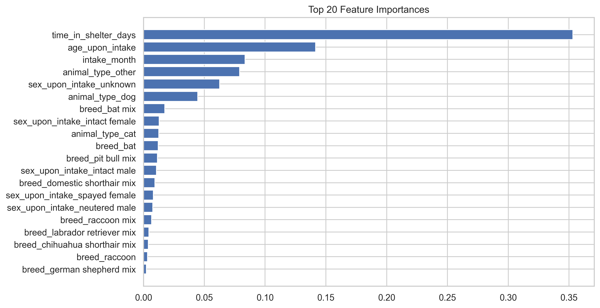
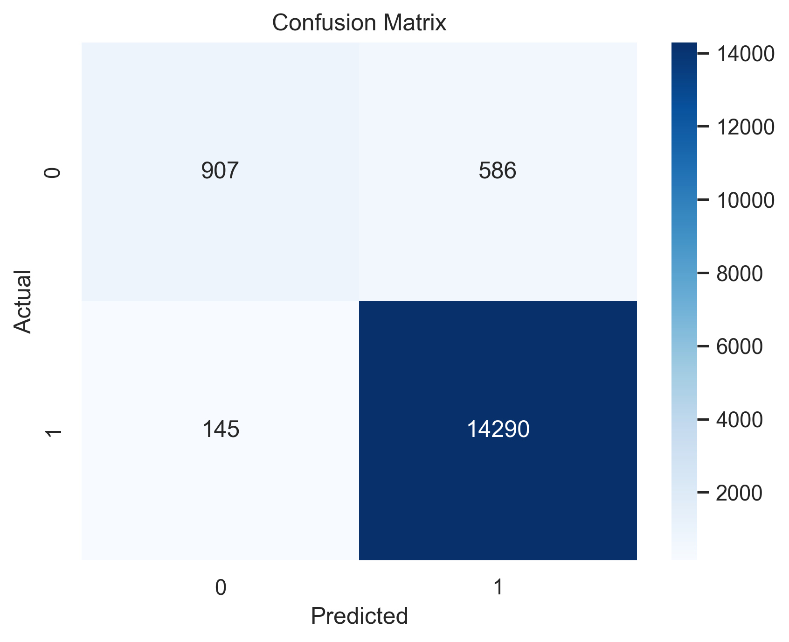
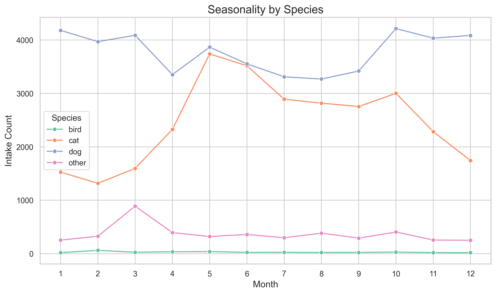

# Shelter Intake & Outcome Analysis
### Predicting Positive Outcomes at the Austin Animal Center

This project explores intake and outcome data from the Austin Animal Center to understand the factors that shape an animal’s likelihood of a positive outcome. Through structured data cleaning, exploratory analysis, and a machine learning model with interpretable insights, the project uncovers patterns in age, intake type, species, and length of stay that influence adoption and return‑to‑owner rates. The goal is to translate raw shelter data into actionable findings that can support operational planning and improve animal welfare outcomes.

### Results at a Glance
- **Model Performance**: The Random Forest classifier achieved strong predictive performance, accurately distinguishing positive from negative outcomes using structured intake features.
- **Top Predictors**: Age at intake, length of stay, intake type, and species emerged as the most influential factors driving outcome predictions.
- **Key Insights**: Younger animals and those with shorter shelter stays were significantly more likely to experience positive outcomes. Intake type also played a major role, with strays showing distinct patterns compared to owner surrenders.
- **Seasonal Trends**: Cat intakes showed clear seasonal spikes during spring and summer, aligning with known kitten‑season patterns and influencing overall shelter capacity.
- **Operational Value**: The findings highlight opportunities to reduce length of stay, anticipate seasonal surges, and tailor interventions for high‑risk intake types to improve overall shelter outcomes.

### Feature Importance


**Feature Importance:** The Random Forest model identified age at intake, length of stay, intake type, and species as the strongest predictors of positive outcomes. These features consistently shaped the model’s decision‑making and aligned with patterns observed during EDA.

### Confusion Matrix



**Confusion Matrix:** The model performs well at identifying positive outcomes while maintaining reasonable sensitivity to negative outcomes. This balance is important for shelters aiming to flag at‑risk animals early.

### Seasonality by Species



**Seasonality by Species:** Cat intakes show strong seasonal spikes during spring and summer, reflecting known kitten‑season patterns. These trends help explain fluctuations in shelter population and resource needs throughout the year.

## Project Struture
shelter-intake-outcome-analysis
- data    #Original Dataset
- processed #Cleaned Dataset for Modeling
- notebooks
  - 01_data_cleaning.ipynb
  - 02_eda.ipynb
  - 03_predictive_modeling.ipynb
- README.md
  - environment.yml


## Project Goals
- Clean and standardize Austin Animal Center intake dataset
- Explore trends in intake types, outcomes, seasonality, and animal characteristics
- Engineer meaningful features such as age (in days) and length of stay (in days)
- Build a predictive model to classify positive vs. negative outcomes
- Provide insights that can support shelter decision-making and resource allocation


## Data Cleaning & Preparation

Key steps included:
- Converting age strings (e.g., "2 years", "3 weeks") into numeric days
- Extracting intake month to capture seasonal patterns
- Standardizing categorical fields (breed, sex, animal type)
- Handling missing values in both numeric and categorical features
- Removing duplicates and invalid records

The cleaned dataset is stored in 'shelter-intake-outcome-analysis/processed/aac_cleaned.csv'. 


## Exploratory Data Analysis (EDA)

Notebook 2 explores:
- Intake trends over time
- Outcome distribution
- Seasonal patterns (kitten season, holiday adoptions)
- Age and breed distributions
- Length-of-stay patterns
- Differences between dogs and cats

These visualizations help frame the modeling approach and highlight operational challenges. 


## Modeling Approach

A **Random Forest Classifier** was selected because it:
- Handles mixed data types (categorical + numeric)
- Manages high-cardinality features such as breed
- Captures non-linear relationships and interactions
- Is robust to noise and imperfect real-world data
- Provides interpretable feature importances

The model was trained using: 
- One-hot encoding for categorical variables
- Median/mode imputation for missing values
- A balanced class weight to address outcome imbalance
- A train/test split with stratification


## Model Performance

The model achieved strong performance on the test set, with balanced precision and recall across classes. A confusion matrix and classification report are included in Notebook 3. 


## Key Insights

The model revealed several important predictors of positive outcomes:
- **Shorter shelter stays** strongly correlate with positive outcomes
- **Younger animals** tend to have higher adoption and return-to-owner rates
- **Breed** plays a significant role, reflecting adopter preferences
- **Animal yype** (dog vs cat) influences outcome patterns
- **Spayed/neutered animals** have higher positive outcomes
- **Intake month** captures seasonal trends in shelter operations. 

These insights can support targeted programs such as senior-pet adoption campaigns, intake-to-surgery workflow improvements, and seasonal staffing adjustments.


## How to Run This Project

### 1. Clone the repository
```bash
git clone https://github.com/ashleylwalton/shelter-intake-outcome-analysis.git
cd shelter-intake-outcome-analysis
```
### 2. Create the Environment
```
conda env create -f environment.yml 
conda activate shelter-analysis
```

### Open VS Code or Jupyter; Run the notebooks in order:
- 01_data_cleaning.ipynb
- 02_eda.ipynb
- 03_predictive_modeling.ipynb

## Future Improvements
- Additional models for comparision (XGBoost, Logistic Regression)
- Perform hyperparameter tuning
- Build SHAP explanations for deeper interpretability
- Create a lightweight dashboard for shelter staff
- Explore text features (notes, descriptions, using NLP)


## About the Dataset

Data comes from the Austin Animal Center, the largest no-kill municipal shelter in the United States. It include intake and outcome records for dogs, cats, and other animals. 


## Author

Ashley L. Walton
Data Scientist | Wildlife Ecology & Data Science

Focused on real-world, mission-driven analytics projects
